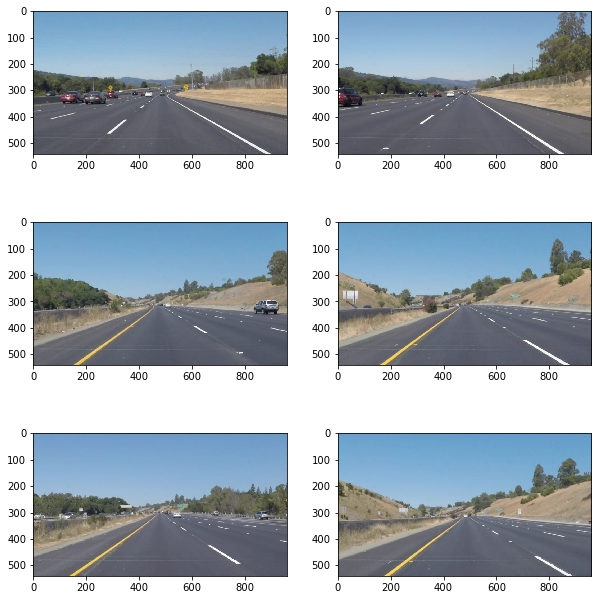

# **Finding Lane Lines on the Road** 
---
In this project, I will be detecting lane lines on an image or a video of  the highway with moving traffic using python and supporting libraries.

## **Goal**

The main objective of this project is to identify the lane lines from a video feed or an image. Once the lane lines are identified we want to draw the identified lines over the existing image or video.

---

### Reflection

### Input Images
The road images provided to identify the lanes lines are the following. These have some features that we would like to extract, lane lines are always either yellow or white and they are vertical and never horizontal. In most case only the lower half of the image have useful information regarding to the lane lines.

### 1.Pipeline 
In order to achieve the above goal, we will need to preprocess the image and make use of image prodessing tecnhiques in identifying lines in an image. 

The various techniques we will be using in the project are :

- Color Selection
- Converting to grayscale
- Region of Interest Selection
- Gaussian smoothing
- Canny Edge Detecion
- Hough Transform line detection

### **Color Selection**
As the first step of image processing we do a simple color selection. To identify the lane lines accurately the only significant colors are the different shades of **yellow** and **white** .

we use HSL ( Hue,Saturation and Lightness) representation of RGB color map. This representation rearranges the geometry of RGB into cylindrical co-ordinate system opposed to the cartesian system representation of RGB system. This is a popular technique to isolate a particular shade of pixels from an image.

#### Process
- Convert the image from RGB to HLS using `cv2.cvtColor`
- create two masks one for extracting white pixels and the other for extracting yellow pixels
- combine the two masks
- superimpose the mask on the converted image

In order to draw a single line on the left and right lanes, I modified the draw_lines() function by ...

If you'd like to include images to show how the pipeline works, here is how to include an image: 

### 2. Identify potential shortcomings with your current pipeline

One potential shortcoming would be what would happen when ... 

Another shortcoming could be ...

### 3. Suggest possible improvements to your pipeline

A possible improvement would be to ...

Another potential improvement could be to ...
