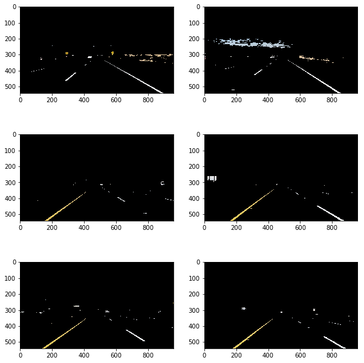
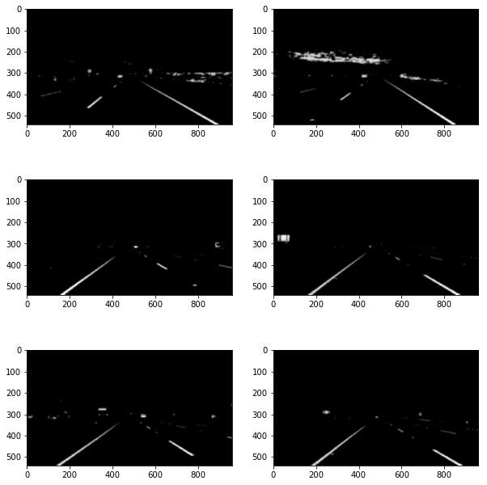
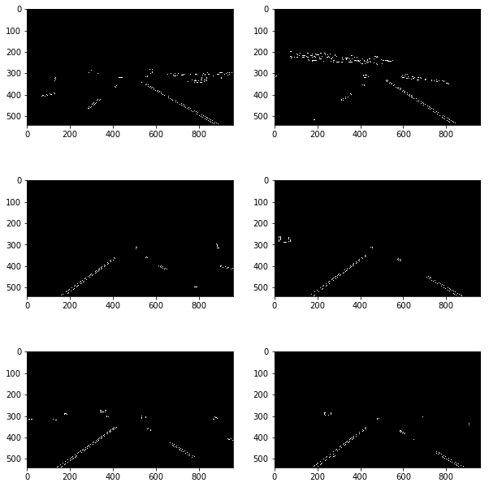
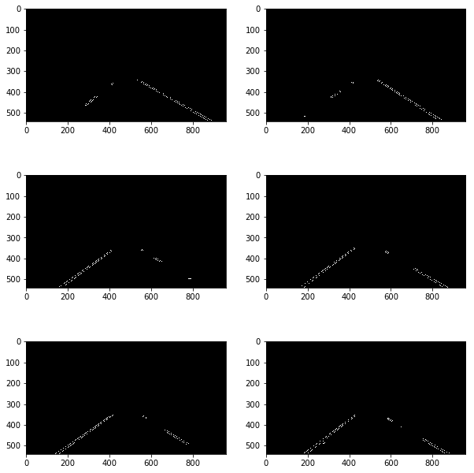
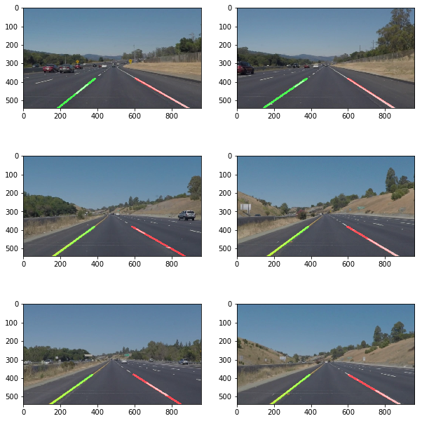

# **Finding Lane Lines on the Road** 
---
In this project, I will be detecting lane lines on an image or a video of  the highway with moving traffic using python and supporting libraries.

## **Goal**

The main objective of this project is to identify the lane lines from a video feed or an image. Once the lane lines are identified we want to draw the identified lines over the existing image or video.

---

### Reflection

### Input Images
The road images provided to identify the lanes lines are the following. These have some features that we would like to extract, lane lines are always either yellow or white and they are vertical and never horizontal. In most case only the lower half of the image have useful information regarding to the lane lines.

### 1.Pipeline 
In order to achieve the above goal, we will need to preprocess the image and make use of image prodessing tecnhiques in identifying lines in an image. 

The various techniques we will be using in the project are :

- Color Selection
- Converting to grayscale
- Region of Interest Selection
- Gaussian smoothing
- Canny Edge Detecion
- Hough Transform line detection

### **Color Selection**
As the first step of image processing we do a simple color selection. To identify the lane lines accurately the only significant colors are the different shades of **yellow** and **white** .

we use HSL ( Hue,Saturation and Lightness) representation of RGB color map. This representation rearranges the geometry of RGB into cylindrical co-ordinate system opposed to the cartesian system representation of RGB system. This is a popular technique to isolate a particular shade of pixels from an image.

#### Process
- Convert the image from RGB to HLS using `cv2.cvtColor`
- create two masks one for extracting white pixels and the other for extracting yellow pixels
- combine the two masks
- superimpose the mask on the converted image

### **Gray Scaling**
Next we convert the filtered images into gray scale images, in order to better assist in the canny edge detection, which finds the intesity gradients of the image. We use `cv2.cvtColor(img, cv2.COLOR_RGB2GRAY)` to convert RGB image to graysclae image

### **Gaussian Smoothing**
We apply a gaussian filter to the gray scaled image, since the edge detection is easily affected by image noise. Applying a a guassian filter prevents false detection. `cv2.GaussianBlur` is used to apply gaussian smoothing.

### **Canny Edge Detection**
Canny Edge Detection is a technique that uses multi-stage algorithm to detect a wide range of edges in images. we use `cv2.Canny` to detect the canny edges in the image

### **Region of Interest**
We apply another image mask to extract only the pixels in the region of interest. Region of interest is a polyon area which contains the most significant information relating to the lanes and the road. We do this to avoid unnecessay detection of lines in the surroudings. Based on the camera position the lanes always fall within a certain polygon region.

### **Hough Transform**
 Finally we perform haugh transform on the extracted image to identify the vertical lines (lanes) and we execute the `draw_lines` function to connect the disjoint lane lines. In performing the hough line transform we define various parameters and tune them by trial and error.
 
 Parameters to Tune:
 - rho - Distance resolution in pixels
 - theta - Angle resolution in radians
 - threshold - Accumulator threshold parameter
 - min_line_length - Minimum line length. 
 - max_line_gap - Maximum gap allowed between points on the same line.
 
 
 After identfying the lane lines we superimpose the identified lane lines on top of the original images to display and asses the accuracy of the lane detection.
 
 ### **Draw lines**
 This is an utility function that we use to draw the lines after performing hough transform. From the lines detected by hough transform, we classify the lines into right and left lane lines by identifying their slope. If the slope is greater than 0 then it is a right lane line and if it is less than 0 than it is a left lane line. We also ignore if any horizontal line is detected due to image distortions.
 
We store all the right line points and left line points captured from a specific image and use `np.linalg.lstq()` function to find the linear least squares solution to best fit the detected points. we then plot the line on the image using the Region of interest boudaries as teh boudary limits.

### 2. Potential shortcomings with the current pipeline
There are couple of shortcomings / potential shortcomings to the existing algorithm I have used to detect lane lines.

1. Since I have tried the lane line detection only on images and videos captured in daylight, there might be a performance issues or drastic variation in lane detection accuracy if the lighting conditions of the input images changes, especially if it is captured during the night.

2. The lane line detection is not accurate and even intersect at many instances in the chanllenge video, due to the curved nature of the road in the challenge video.

3. There is a potential issue when an image is captured at a cross roads where horizontal lane lines are also possible. 

4. Finding stop lines which are horizontal is not going to be possible with this method.

### 3. Possible improvements to the pipeline

One possible improvement we can do to the pipeline is to update the `draw_lines` funtion to implement a low pass filter and not to change the slopes of the lane lines drastically between each iterattion of the images in order to maintain a smoother lane line detection in curved lanes.

Secondly, we can also try to implement a dynamic Region of Interest detection algorithm to maximize the valuable data in each image.

